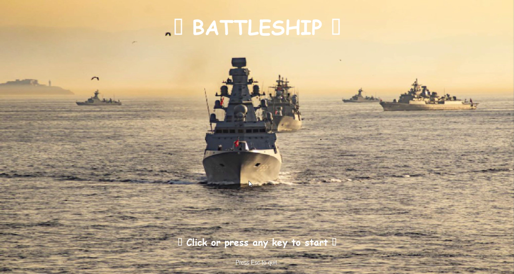
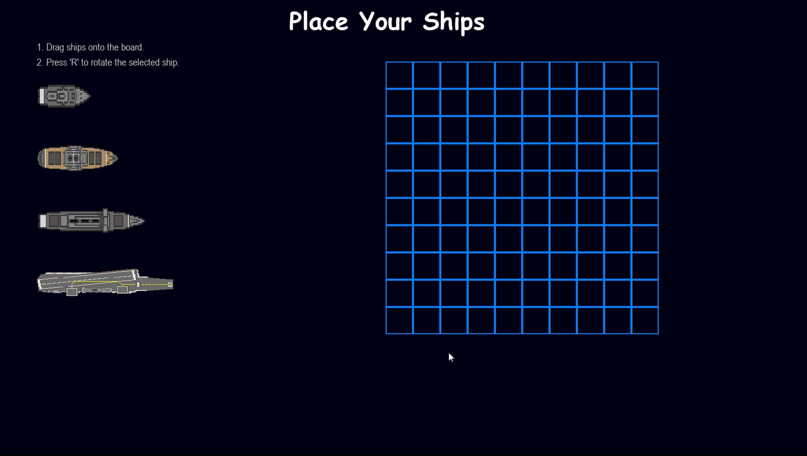
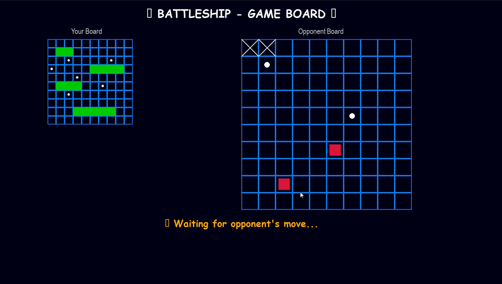

# Battleship Multiplayer (Python)

A two-player Battleship game built with Python, Pygame, and TCP sockets.  
Originally developed as a Computer Networks course project, this application runs on a local network using a classic client–server architecture.

## 📸 Screenshots

### Start Screen


### Ship Placement


### Gameplay


## 🎮 Features

- Two-player multiplayer (Player1 vs Player2)
- TCP socket–based communication
- Server–client architecture
- Fullscreen graphical interface with Pygame
- Drag-and-drop ship placement
- Rotate ships with the R key
- Visual and audio feedback for hit, miss, and sink
- Separate screens for: start menu, ship placement, waiting, gameplay, game-over

## 🧱 Project Structure

```
battleship-game/
  ├── src/
  │     server.py
  │     client1.py
  │     client2.py
  │
  ├── assets/
  │     images/
  │         ship2.png
  │         ship3.png
  │         ship4.png
  │         ship5.png
  │         sea_background.jpg
  │
  │     sounds/
  │         hit.wav
  │         miss.wav
  │         start.mp3
  │         win.mp3 (optional)
  │
  └── README.md
```

## ⚙️ Installation

1. Clone the repository:

```
git clone https://github.com/mVefa/battleship-multiplayer-python.git
cd battleship-multiplayer-python
```

2. Install the dependency:

```
pip install pygame
```

Python 3.x and pip must be installed.

## ▶️ How to Run

Open 3 separate terminals:

**Terminal 1 – Start the server**

```
cd battleship-multiplayer-python/src
python server.py
```

**Terminal 2 – Start Player 1**

```
cd battleship-multiplayer-python/src
python client1.py
```

**Terminal 3 – Start Player 2**

```
cd battleship-multiplayer-python/src
python client2.py
```

## 🌐 Running on a Local Network (LAN)

1. Find the server machine’s IP address (e.g., 192.168.1.10)  
2. Replace the HOST value in the Python files:

```
HOST = "192.168.1.10"
```

3. Start server on that machine, and run client1/client2 from other devices on the same network.

## 🕹️ Gameplay Overview

- Players place ships by dragging them onto the grid  
- Press R to rotate a ship  
- After all ships are placed, press START  
- When both players are ready, the server starts the match  
- Players take turns selecting grid cells on the opponent’s board  
- Server sends hit/miss/sink results to both clients  
- First player to sink all enemy ships wins  

## 🧠 Architecture & Communication

- Server maintains:
  - Player names
  - Ship positions
  - Turn order
  - Hit/miss/sink logic
  - Game-over state

- All communication is done using JSON messages over TCP sockets:
  - join  
  - place  
  - ready  
  - move  
  - result  
  - opponent_move  
  - gameover  
  - turn  

## 🛠️ Technologies Used

- Python 3  
- Pygame  
- TCP sockets  
- Threading  
- JSON messaging  

## 🔮 Possible Improvements

- In-game chat  
- Configurable board sizes  
- AI opponent  
- Online matchmaking  
- Web-based version  

## 📄 License

This project is licensed under the MIT License.
